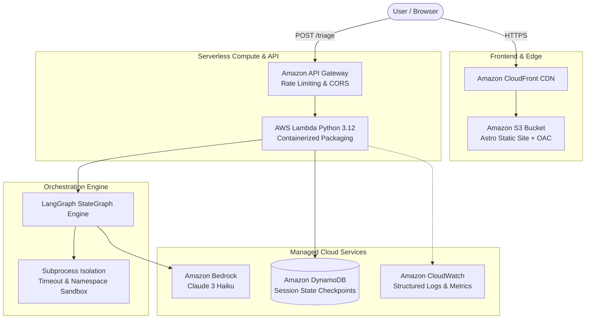

# Test-Case Triage Coach

[](https://aws.amazon.com/serverless/)
[](https://aws.amazon.com/bedrock/)
[](https://github.com/langchain-ai/langgraph)
[](https://www.python.org/)
[](https://astro.build/)
[](.github/workflows/ci.yml)
[](LICENSE)

An intelligent, serverless algorithmic coaching system that diagnoses why code fails test cases and delivers progressive hint tiers without spoiling the solution.

Built for the **AWS Builder Center Weekend Challenge: Deploy Your First App on AWS**.

---

## Key Features

- **Progressive Hint Escalation**:
  - **Tier 0 (Conceptual Nudge)**: Highlights algorithmic invariants without code specifics.
  - **Tier 1 (Targeted Pointer)**: Directs attention to specific logic flaws or data structure limits.
  - **Tier 2 (Code Patch & Explanation)**: Delivers full fix only when requested.
- **5 Curated DSA Archetypes**:
  - **Two Sum**: Hash Map vs. nested loops, index preservation.
  - **Valid Parentheses**: Stack vs. counters, bracket matching.
  - **Binary Search**: Logarithmic bounds, off-by-one boundary bugs.
  - **Longest Substring**: Sliding window index jumping.
  - **Merge Two Sorted Lists**: Two pointers, remainder handling.
- **Universal "Any Question" Engine**: Paste any problem description and let Amazon Bedrock synthesize the starter code and edge-case test suite automatically.
- **Isolated Sandbox**: Multi-layered execution isolation with timeout limits, restricted namespace, and memory protection.
- **Session Checkpointing**: Amazon DynamoDB stores state and tracks attempts and escalation levels per user session.

---

## Architecture



---

## Repository Structure

```
DSA_coach/
├── README.md                   # Project documentation & overview
├── ARCHITECTURE.md             # Technical architecture specification
├── SUBMISSION_ARTICLE.md       # Publish-ready AWS Builder challenge article
├── .github/workflows/ci.yml    # Automated CI/CD pipeline
├── backend/
│   ├── pyproject.toml          # Python package definitions
│   ├── template.yaml           # AWS SAM Serverless template
│   ├── src/
│   │   ├── requirements.txt
│   │   └── triage_coach/
│   │       ├── handler.py      # AWS Lambda entrypoint
│   │       ├── config.py       # Environment configuration
│   │       ├── clients/        # Mockable Bedrock & DynamoDB clients
│   │       ├── graph/          # LangGraph nodes, state & sandbox
│   │       └── problems/       # 5 curated DSA problem archetypes
│   └── tests/
│       ├── unit/               # 40+ unit tests (moto & mocked Bedrock)
│       └── integration/        # End-to-end graph evaluation tests
├── frontend/
│   ├── src/
│   │   ├── components/         # TriageForm interactive island
│   │   ├── lib/                # Problems catalog & API client
│   │   ├── pages/              # Astro pages
│   │   └── styles/             # Vercel Geist design tokens
│   └── dist/                   # Built production static site
└── scripts/
    ├── deploy_backend.sh       # Containerized SAM build & deployment script
    └── deploy_frontend.sh      # Static site deployment to S3 / CloudFront
```

---

## Quick Start (Local Development)

### 1. Backend Testing
```bash
# Install dependencies
pip install -e backend/
pip install pytest moto[dynamodb]

# Run all 45 automated tests
pytest backend -v
```

### 2. Frontend Development Server
```bash
cd frontend
npm install
npm run dev
# Open http://localhost:4321
```

---

## Deploy to AWS

### Prerequisites
- AWS CLI configured with active credentials (`aws configure`)
- Amazon Bedrock model access enabled (`anthropic.claude-3-haiku-20240307-v1:0`) in your region
- Docker installed and running

### 1. Deploy Serverless Backend
```bash
./scripts/deploy_backend.sh
```
*Note the returned API Gateway endpoint URL (e.g. `https://abc123xyz.execute-api.us-east-1.amazonaws.com/Prod/triage`).*

### 2. Configure Frontend
Add the API Gateway endpoint to `frontend/.env`:
```bash
PUBLIC_API_URL=https://your-api-id.execute-api.us-east-1.amazonaws.com/Prod/triage
```

### 3. Deploy Frontend
```bash
FRONTEND_BUCKET_NAME=your-s3-bucket ./scripts/deploy_frontend.sh
```

---

## Cost Optimization

This application runs inside the **AWS Free Tier** with zero idle costs:
- **AWS Lambda**: 1,000,000 free requests / month
- **Amazon DynamoDB**: 25 GB free storage + 25 WCU / RCU
- **Amazon API Gateway**: 1,000,000 free REST calls / month
- **Amazon CloudFront**: 1 TB data transfer out / month
- **Estimated Total Cost**: **$0.00 / month** (under standard free tier usage)

---

## License

This project is licensed under the MIT License - see the [LICENSE](LICENSE) file for details.
