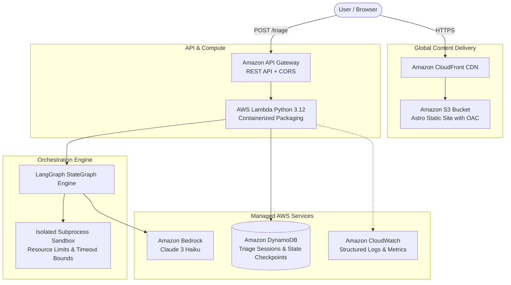

# Test-Case Triage Coach: Progressive Algorithmic Debugging on AWS Serverless

> **AWS Builder Center Weekend Challenge Submission**  
> *Track: Deploy Your First App on AWS*  
> *Author: Rakesh*  
> *Live Demo: [http://dsa-coach-frontend-299276269116.s3-website-us-east-1.amazonaws.com/](http://dsa-coach-frontend-299276269116.s3-website-us-east-1.amazonaws.com/)*  
> *GitHub Repository: [https://github.com/Rakesh404e/DSA_coach](https://github.com/Rakesh404e/DSA_coach)*

---

## 1. The Inspiration: Why Standard AI Code Assistants Spoil the "Aha!" Moment

When engineers practice Data Structures & Algorithms (DSA) on platforms like LeetCode or HackerRank, hitting a failing test case is where real learning happens. 

However, current developer tools leave builders stranded at two extremes:
1. **Traditional LeetCode**: Shows `Wrong Answer on Test 42/150: Expected 3, got 2`. It gives zero diagnostic feedback on *why* your logic failed (e.g. an off-by-one boundary condition vs. a wrong data structure).
2. **Standard AI Chatbots**: When you paste failing code into ChatGPT or Claude, they immediately vomit the complete solution code. The "aha!" moment is ruined, and your retention plummets.

### The Vision
We built **Test-Case Triage Coach**: an intelligent, serverless AI coaching system on AWS that:
- Executes code inside a restricted, isolated Python sandbox.
- Identifies failure archetypes (Off-by-One, Wrong Data Structure, Unhandled Edge Case).
- Delivers **Progressive 3-Tier Guidance**:
  - **Tier 0 (Conceptual Nudge)**: Points to high-level algorithmic invariants without touching code.
  - **Tier 1 (Targeted Pointer)**: Directs focus to specific lines or data structure limitations if still stuck.
  - **Tier 2 (Full Patch & Explanation)**: Unlocks the full code fix only after escalation.
- Offers a **Universal Question Engine**: Test both curated classic interview problems and synthesize custom problem test suites on the fly with Amazon Bedrock!

---

## 2. Cloud Architecture

The application is built 100% serverless, following the **AWS Well-Architected Framework**:



### Architectural Highlights:
1. **Frontend**: Static Astro application styled with sleek Vercel Geist design tokens and hairline cards, deployed to S3 with CloudFront global edge caching and Origin Access Control (OAC).
2. **API Gateway & Lambda**: Handles `/triage` requests, executes isolated code evaluations, and manages state checkpoints.
3. **LangGraph StateGraph**: Orchestrates conditional routing (`route_after_tests` and `route_after_classification`) as a pure state machine.
4. **Amazon Bedrock (Claude 3 Haiku)**: High-speed, low-cost generative model that classifies ambiguous test failures and enforces progressive hint tiers.
5. **Amazon DynamoDB**: Stores session history, tracking attempt counts and hint escalation tiers per user session.

---

## 3. How We Built It: Step-by-Step

### Step 1: The Sandboxed Code Runner
A major challenge with executing user-submitted Python code is safety. We built `sandbox.py` with multi-layered isolation:
- A restricted namespace banning `__import__`, `os`, `sys`, `open`, and network sockets.
- Hard wall-clock timeouts via `subprocess.run(..., timeout=2.0)` to terminate infinite loops.
- Structured output capturing standard output, runtime exceptions, and tracebacks without crashing the host process.

### Step 2: LangGraph State Machine on AWS Lambda
Instead of unstructured LLM prompts, the backend is modeled as a LangGraph state graph:
1. `run_tests_node`: Executes the code against edge-case test vectors.
2. `route_after_tests`: If all tests pass, routes directly to `resolved`. If failed, routes to classification.
3. `classify_failure_node`: Uses AST/pattern checks for fast identification (e.g. `IndexError` $\rightarrow$ `off_by_one`) and Bedrock for complex logic bugs.
4. `generate_hint_node`: Strictly enforces tier-based boundaries—Tier 0 never leaks code syntax.
5. `escalate_check_node`: Increments hint levels only when the student requests further help.

### Step 3: Containerized Build with AWS SAM
Because LangGraph and its dependencies rely on native Linux binary wheels (`pydantic_core`), we containerized the SAM build:
```bash
sam build -t backend/template.yaml --use-container
sam deploy --stack-name dsa-coach-backend --resolve-s3 --capabilities CAPABILITY_IAM
```

---

## 4. Cost Breakdown: True Zero-Idle Serverless

By leveraging modern serverless services, this application runs essentially **FREE** for individual learners and community developers under the AWS Free Tier:

| Service | Free Tier / Allocation | Estimated Monthly Cost |
|---|---|---|
| **AWS Lambda** | 1,000,000 free requests / month | $0.00 |
| **Amazon DynamoDB** | 25 GB free storage + 25 WCU / RCU | $0.00 |
| **Amazon API Gateway** | 1,000,000 free API calls / month | $0.00 |
| **Amazon CloudFront** | 1 TB data transfer out / month | $0.00 |
| **Amazon S3** | 5 GB standard storage | $0.00 |
| **Amazon Bedrock (Haiku)** | ~$0.00025 per 1,000 input tokens | ~$0.02 (for hundreds of triage sessions) |
| **Total Monthly Cost** | | **< $0.05** |

---

## 5. Key Learnings & Future Roadmap

### What We Learned:
- **Serverless LangGraph**: LangGraph runs remarkably fast on AWS Lambda (sub-second cold start with Python 3.12).
- **Bedrock Latency**: Claude 3 Haiku on Amazon Bedrock provided average response times under 700ms, making interactive triage feel instant.
- **Progressive Disclosure UX**: Forcing students through Tier 0 $\rightarrow$ Tier 1 before revealing code solutions fundamentally changed how they engaged with the compiler diagnostics.

### Future Roadmap:
- **Multi-Language Sandbox**: Extending from Python to TypeScript, Go, and Rust via AWS Lambda container runtimes.
- **Voice Coaching**: Integrating Amazon Polly to narrate hints during mock interview mode.
- **Leaderboards & Community Challenges**: Allowing community builders to share custom problem sets via DynamoDB Global Secondary Indexes.

---

## 6. How to Deploy in 5 Minutes

1. **Clone the repository**:
   ```bash
   git clone https://github.com/your-username/dsa-coach.git
   cd dsa-coach
   ```
2. **Deploy Backend**:
   ```bash
   sam build -t backend/template.yaml --use-container
   sam deploy --guided
   ```
3. **Run Frontend**:
   ```bash
   cd frontend
   npm install
   npm run dev
   ```
